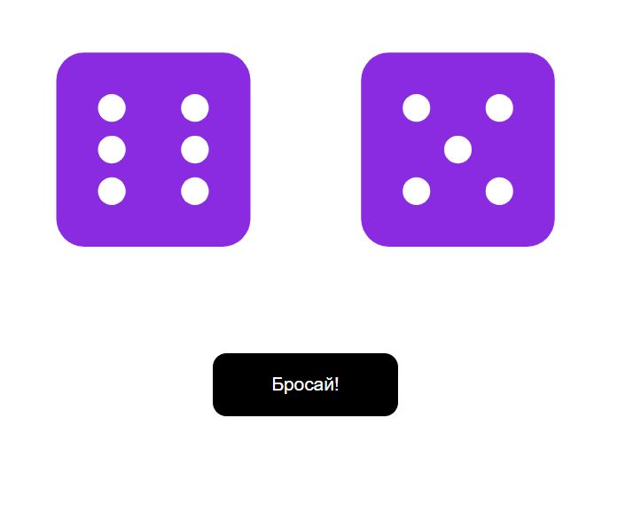

# RollDice

Приложение для игры в кости, которое бросает два кубика и отображает случайное число от 1 до 6. Когда мы нажимаем на кнопку, оба кубика встряхиваются и генерируют новое число, которое отображается на верхней грани кубика (в виде точек, как у стандартных кубиков).

